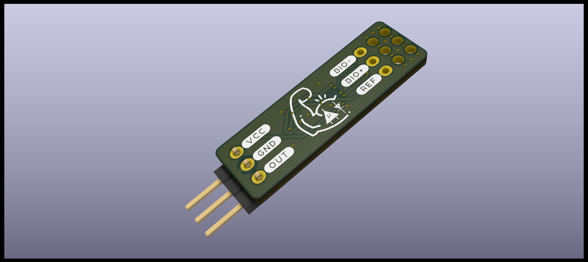
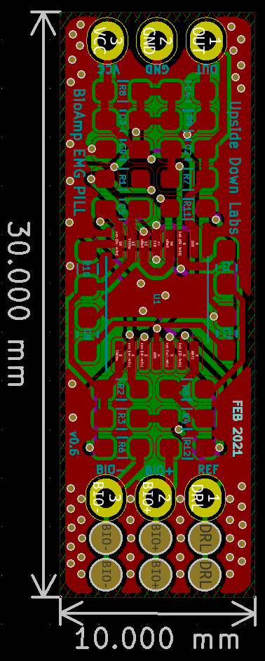
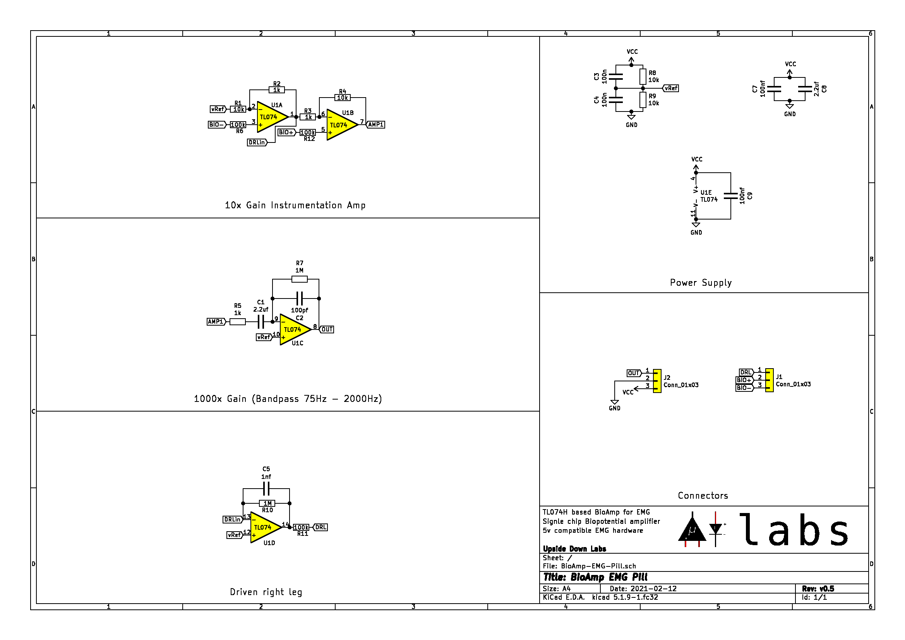

# BioAmp EMG Pill

 

BioAmp EMG Pill is a small and elegant EMG board from Upside Down Labs. The PCB itself is designed to be a single sided board so that you can make it at home using toner transfer method.

#### Hardware

| Front              |  Back |
| :-------------------------: | :-------------------------: |
|   |  |

| Dimensions              |  Schematic |
| :-------------------------: | :-------------------------: |
| 47.50 x 12.40 mm  |  |

## License

#### Hardware
CERN Open Hardware License Version 2 - Strongly Reciprocal ([CERN-OHL-S-2.0](https://spdx.org/licenses/CERN-OHL-S-2.0.html)).

#### Software
MIT open source [license](http://opensource.org/licenses/MIT).

#### Documentation:
 This work is licensed under a <a rel="license" href="http://creativecommons.org/licenses/by/4.0/">Creative Commons Attribution 4.0 International License</a>.