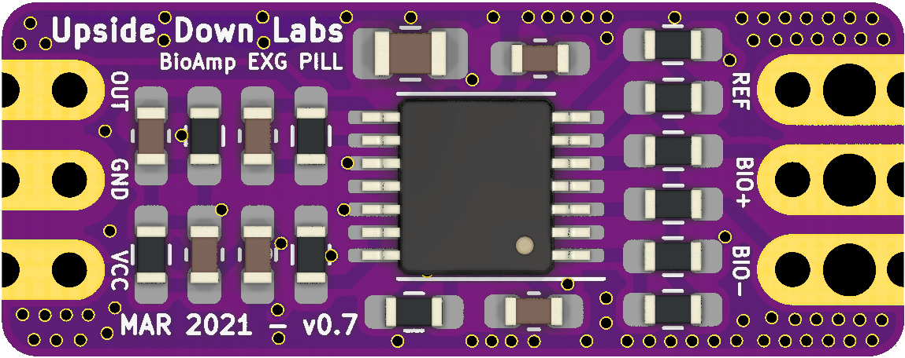
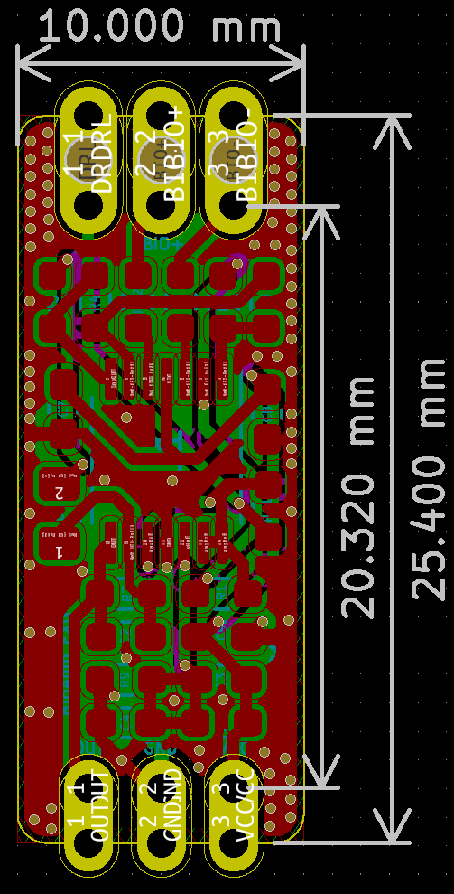

# BioAmp EXG Pill

   

BioAmp EXG Pill is a small (2.54 X 1.00 cm) and elegant Analog Front End (AFE) board for BioPotential signal acquisition that you can use with any 5v Micro Controller Unit (MCU) with an ADC. It is capable of recording publication grade BioPotential signals like ECG, EMG, EOG, and EEG without the inclusion of any dedicated Hardware/Software filter, see [BioAmp EXG Pill v0.7 intro video](www.youtube.com/watch?v=-G3z9fvQnuw) for more info.

#### Hardware

| Front              |  Back |
| :-------------------------: | :-------------------------: |
|   |  |

| Dimensions              |  Schematic |
| :-------------------------: | :-------------------------: |
|   |  |

## License

#### Hardware
CERN Open Hardware License Version 2 - Strongly Reciprocal ([CERN-OHL-S-2.0](https://spdx.org/licenses/CERN-OHL-S-2.0.html)).

#### Software
MIT open source [license](http://opensource.org/licenses/MIT).

#### Documentation:
 This work is licensed under a <a rel="license" href="http://creativecommons.org/licenses/by/4.0/">Creative Commons Attribution 4.0 International License</a>.
