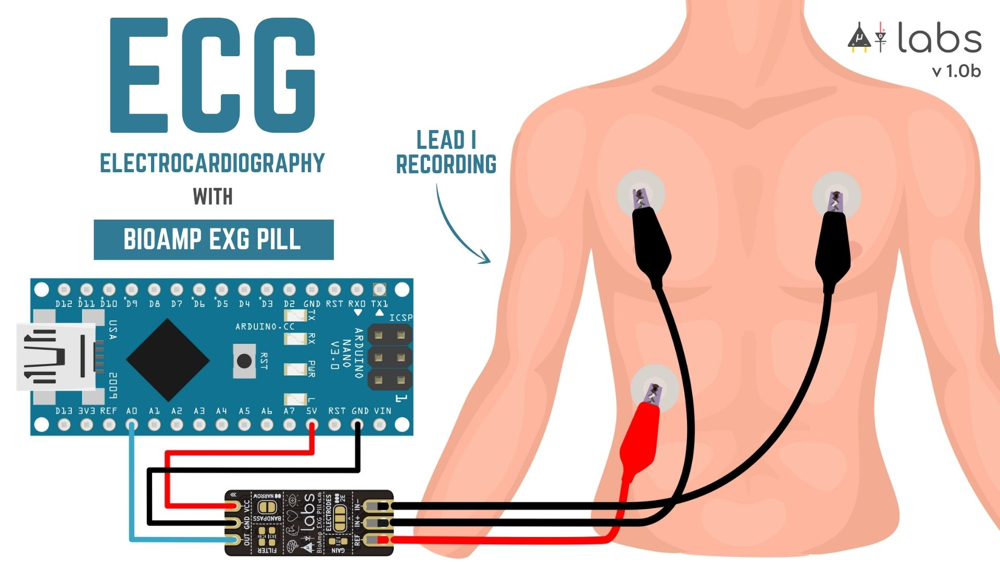

## Electrocardiography (ECG) ❤

We are delighted to share that BioAmp EXG Pill is among the top ten <a href="https://hackaday.com/2021/08/31/ten-winners-of-the-hackaday-prize-supportive-tech-challenge/" style="color: Red; text-decoration: none;"> Winners Of The Hackaday Prize Supportive Tech Challenge </a>. It was all possible because of various <a href="https://github.com/upsidedownlabs/BioAmp-EXG-Pill/tree/main/software" style="color: Red; text-decoration: none;"> Arduino example sketches</a>  and projects that are available for the BioAmp EXG Pill which you can use to create a supportive technology. For example, you can create a mobile heart ailment detection machine, prosthetic hand controller, EOG-based game controller, and many more similar projects. Let’s take a look at how you can use BioAmp EXG Pill to detect heartbeats and potentially create a real-time heart monitor.

## Detecting heartbeats with BioAmp EXG Pill & Arduino Nano

An accurate heartbeat detection (peak detection) algorithm that works on a small microcontroller is a pretty complex task but, with our robust standard deviation-based peak detection algorithm, you can detect heartbeats very easily even on an Arduino Nano.

 

 <b>Resulting ECG Signal Wave</b>

To record ECG and detect a heartbeat in that ECG on an Arduino Nano you first need to flash the <a href="https://github.com/upsidedownlabs/BioAmp-EXG-Pill/blob/main/software/HeartBeatDetection/HeartBeatDetection.ino" style="color: Red; text-decoration: none;">Heart Beat Detection Arduino sketch</a> onto your Nano and then connect the electrodes either on your chest or hands.  

_**Note:** BioAmp EXG Pill is not a certified medical device and shouldn't be treated like one._
  

- ### Chest ECG heartbeat detection

A very basic method for detecting heartbeats is to place the electrodes near the heart, as shown below. You just have to flash the <a href="https://github.com/upsidedownlabs/BioAmp-EXG-Pill/blob/main/software/HeartBeatDetection/HeartBeatDetection.ino" style="color: Red; text-decoration: none;"> Heart Beat Detection Arduino sketch </a>  to your Nano, do the wiring, and connect the electrodes like this:

1. IN- near LEFT shoulder
2. IN+ near RIGHT shoulder
3. REF above Right leg

 

 <b> Wiring and Electrode placement for chest ECG</b>

 

 <b> Chest ECG HeartBeat Detection Video </b>

[Chest ECG HeartBeat Detection Video](https://www.youtube.com/embed/jNXJoB72sxU ':include :type=iframe frameborder=0')

 

- ### Hand EKG heartbeat detection

The BioAmp EXG pill is very sensitive to BioPotential signals, so you can even detect heart beats by connecting the electrodes to your hands (much like how an Apple watch records an ECG). To do this, first flash the <a href="https://github.com/upsidedownlabs/BioAmp-EXG-Pill/blob/main/software/HeartBeatDetection/HeartBeatDetection.ino" style="color: Red; text-decoration: none;"> Heart Beat Detection Arduino sketch </a> to your nano, and then hook up exactly the same wiring as above, and connect the electrodes like this:

1. IN- on LEFT wrist
2. IN+ on RIGHT wrist
3. REF on the back of any hand.

 

 <b> Hand EKG HeartBeat Detection Arduino Sketch </b>

  

 <b> Hand EKG HeartBeat Detection Video </b>

[Hand EKG HeartBeat Detection Video](https://www.youtube.com/embed/5rHjvKB7c1o ':include :type=iframe frameborder=0')

## References

1. Join the <a href="https://discord.gg/6aNknuBkfN" style="color: Red; text-decoration: none;">Upside Down Labs Discord server</a>  for chatting.
2. Subscribe to <a href="https://en.wikipedia.org/wiki/Electrooculography" style="color: Red; text-decoration: none;"> Electrooculography (EOG)</a>  to get notified when we do live.

