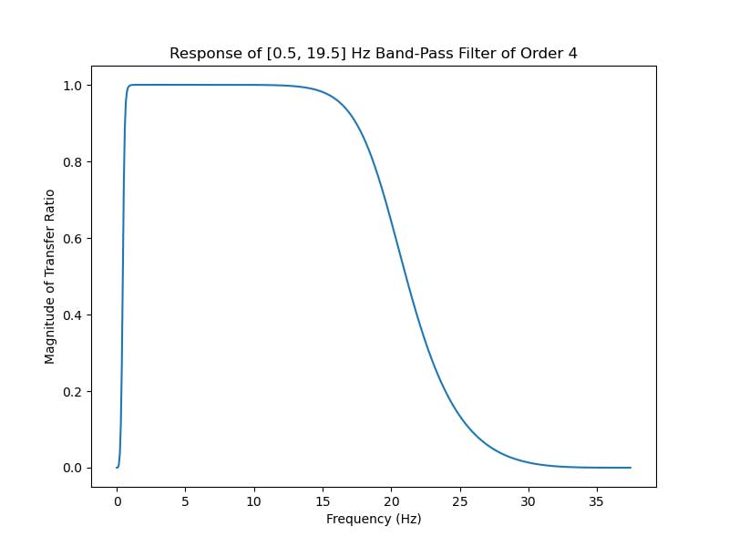

># Electrooculography (EOG) &#128065;&#65039;

   
<a href="https://en.wikipedia.org/wiki/Electrooculography" style="color: brown; text-decoration: none;"> Electrooculography (EOG)</a>
  is a technique for measuring the corneo-retinal standing potential that exists between the front and the back of the human eye. The resulting signal is called the electrooculogram.

  

 <b> Resulting EOG Signal Wave </b>

  

To measure eye movement, pairs of electrodes are typically placed either above and below the eye or to the left and right of the eye. If the eye moves from center position toward one of the two electrodes, this electrode "sees" the positive side of the retina and the opposite electrode "sees" the negative side of the retina. Consequently, a potential difference occurs between the electrodes. Assuming the resting potential is constant, the recorded potential is a measure of the eye's position.

## How to Create an Electrooculograph With BioAmp EXG Pill

EOG is performed using an instrument called an electrooculograph to produce a record called an electrooculogram. Common electrode placement for recording good EOG signal for eye movement (vertical and horizontal) is shown in the diagram below.

 <b> EOG Electrode Placement Sketch </b>

To record nice clean EOG signals with BioAmp EXG Pill, all you need is the Analog Serial Out Arduino example sketch. If you want some more control we also have a <a href="https://github.com/upsidedownlabs/BioAmp-EXG-Pill/tree/main/software/FixedSampling" style="color: brown; text-decoration: none;"> Fixed Sampling example sketch</a>
 for recording EOG and other biopotential signals at a specific sampling rate. You can also use the <a href="https://github.com/upsidedownlabs/BioAmp-EXG-Pill/blob/main/software/EOGFilter/EOGFilter.ino" style="color: brown; text-decoration: none;"> EOG Filter example sketch</a>  for recording EOG at a sampling rate of 75.0 Hz and a frequency of 0.5 - 19.5 Hz. The image below shows the fourth-order Butterworth IIR digital bandpass filter used in the EOG Filter example sketch.
  

 <b> EOG-Filter Sketch</b>

_**Note**: BioAmp EXG Pill is not a certified medical device and should not be treated like one._

## Recording Horizontal Eye Movement

To record horizontal eye movement, place the electrodes near your left and right eyes, just like in the image shown below. Then you just have to flash the <a href="https://github.com/upsidedownlabs/BioAmp-EXG-Pill/blob/main/software/EOGFilter/EOGFilter.ino" style="color: brown; text-decoration: none;"> EOG filter program </a>  onto your MCU, complete the wiring, and connect the electrodes like this:

1. `IN-` near right eye
2. `IN+` near left eye
3. `REF` behind ear
  

 <b> Horizontal Eye-Movement Sketch </b>

  

 <b> Horizontal Eye-Movement Recording</b>

<iframe title="vimeo-player" src="https://player.vimeo.com/video/605740636?h=68382bb00a" width="560" height="315" frameborder="0" allowfullscreen></iframe>

## Recording Vertical Eye Movement

To record vertical eye movement, place the electrodes above and below your left or right eye, just like in the image shown below. Then, just like before, flash the <a href="https://github.com/upsidedownlabs/BioAmp-EXG-Pill/blob/main/software/EOGFilter/EOGFilter.ino" style="color: brown; text-decoration: none;"> EOG filter program </a> onto your MCU, complete the wiring, and connect the electrodes like this:

1. `IN-` above eye
2. `IN+` below eye
3. `REF` behind ear
  

 <b> Vertical Eye-Movement Sketch </b>

## Eye-Blink Detection

Eye blinks can also be recorded with the same electrode placement. Although we used an Arduino Nano for our testing, you can flash the <a href="https://github.com/upsidedownlabs/BioAmp-EXG-Pill/blob/main/software/EyeBlinkDetection/EyeBlinkDetection.ino" style="color: brown; text-decoration: none;">Arduino eye-blink detection sketch</a>
onto any Arduino-compatible board and use it to detect eye blinks. The video below shows a working demo:
  

 <b> Eye Blink Detection Recording</b>

<iframe title="vimeo-player" src="https://player.vimeo.com/video/605736032?h=bf6b7bcb55" width="560" height="315" frameborder="0" allowfullscreen></iframe>

## References

1. <a href="https://en.wikipedia.org/wiki/Electrooculography" style="color: brown; text-decoration: none;"> https://en.wikipedia.org/wiki/Electrooculography</a>
2. <a href="https://github.com/ChinmayLonkar/MarioEMG" style="color: brown; text-decoration: none;">https://github.com/ChinmayLonkar/MarioEMG</a>