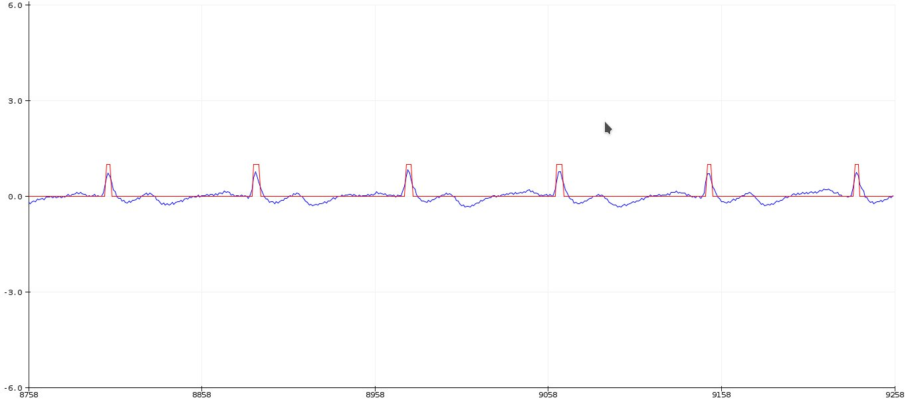
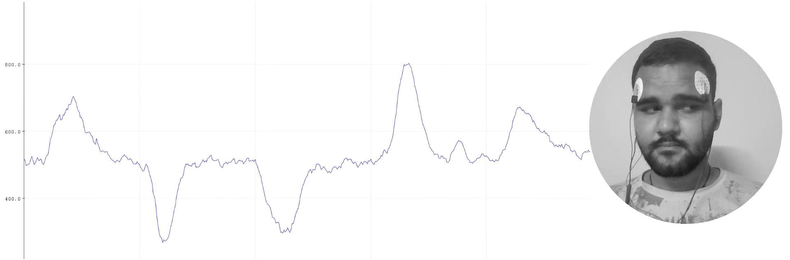
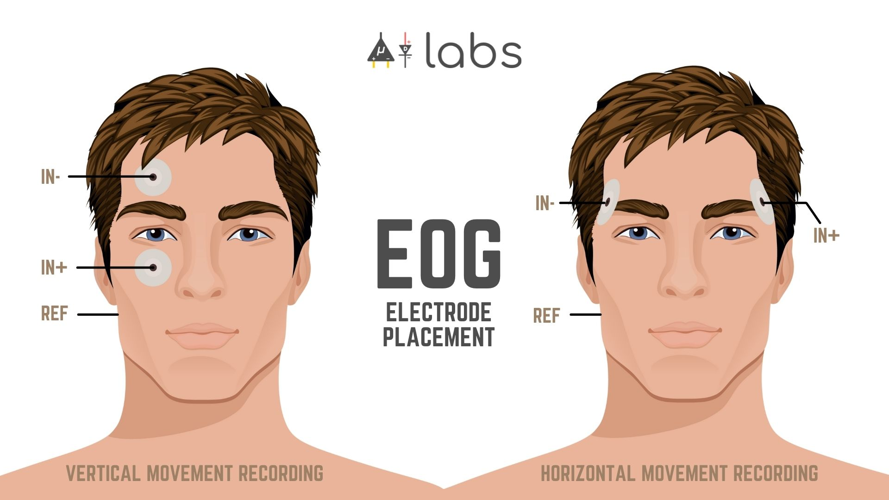
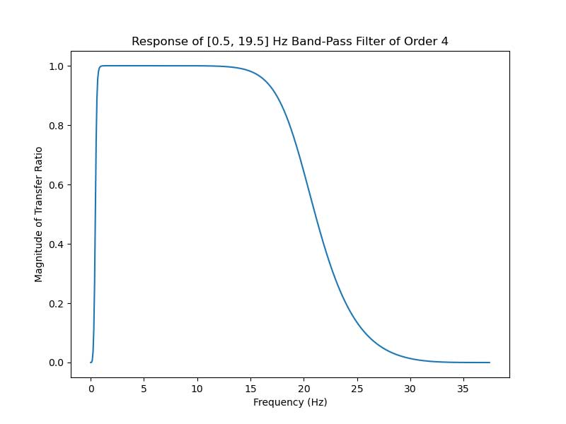

Applications
============

1. :ref:`Electrocardiography <open0>`
2. :ref:`Electroencephalography <open1>`
3. :ref:`Electromyography <open2>`
4. :ref:`Electrooculography <open3>`

.. _open0:

Electrocardiography 
**********************
		
We are delighted to share that BioAmp EXG Pill is among the top ten `Winners Of The Hackaday Prize Supportive Tech Challenge <https://hackaday.com/2021/08/31/ten-winners-of-the-hackaday-prize-supportive-tech-challenge/>`_ .It was all possible because of various `Arduino example sketches <https://github.com/upsidedownlabs/BioAmp-EXG-Pill/tree/main/software>`_ and projects that are available for the BioAmp EXG Pill which you can use to create a supportive technology. For example, you can create a mobile heart ailment detection machine, prosthetic hand controller, EOG-based game controller, and many more similar projects. Let's take a look at how you can use BioAmp EXG Pill to detect heartbeats and potentially create a real-time heart monitor.

**Detecting heartbeats with BioAmp EXG Pill & Arduino Nano**
------------------------------------------------------------

   Bioamp-EXG-Pill Electrocardiography-wave

 
To record ECG and detect a heartbeat in that ECG on an Arduino Nano you first need to flash the `Heart Beat Detection Arduino sketch <https://github.com/upsidedownlabs/BioAmp-EXG-Pill/blob/main/software/HeartBeatDetection/HeartBeatDetection.ino>`_  onto your Nano and then connect the electrodes either on your chest or hands.    

.. note ::

   BioAmp EXG Pill is not a certified medical device and shouldn't be treated like one.

|

**1. Chest ECG heartbeat detection**
------------------------------------
  

A very basic method for detecting heartbeats is to place the electrodes near the heart, as shown below. You just Heart have to flash the `Heart beat Detection Arduino sketch <https://github.com/upsidedownlabs/BioAmp-EXG-Pill/blob/main/software/HeartBeatDetection/HeartBeatDetection.ino>`_ to your Nano, do the wiring, and connect the electrodes like this:

1. IN- near LEFT shoulder
2. IN+ near RIGHT shoulder
3. REF above Right leg

|

.. figure:: images/ECG/bioamp-exg-pill-electrocardiography-Lead1.jpg        
   :width: 600px 
   :alt: Wiring and Electrode placement for chest ECG

   Wiring and Electrode placement for chest ECG

|

.. raw:: html
    
   <iframe width="540" height="320" style="display:block; margin:0 auto;" src="https://www.youtube.com/embed/jNXJoB72sxU" title="YouTube video player" frameborder="0" allow="accelerometer; autoplay; clipboard-write; encrypted-media; gyroscope; picture-in-picture" allowfullscreen ></iframe>

|

**2. Hand EKG heartbeat detection**
-----------------------------------

The BioAmp EXG pill is very sensitive to BioPotential signals, so you can even detect heart beats by connecting the electrodes to your hands (much like how an Apple watch records an ECG). To do this, first flash the `Heart Beat Detection Arduino sketch <https://github.com/upsidedownlabs/BioAmp-EXG-Pill/blob/main/software/HeartBeatDetection/HeartBeatDetection.ino>`_ to your nano, and then hook up exactly the same wiring as above, and connect the electrodes like this:

1. IN- on LEFT wrist
2. IN+ on RIGHT wrist
3. REF on the back of any hand.

|

.. figure:: images/ECG/bioamp-exg-pill-electrocardiography-hand.jpg                 
   :width: 600px                                                                    
   :alt: Bioamp-EXG-Pill Electrocardiography-hand

   Bioamp-EXG-Pill Electrocardiography-hand

|

**References**
--------------

1. Join the `Upside Down Labs Discord server <https://discord.gg/6aNknuBkfN>`_ for chatting.
2. Subscribe to `Electrooculography (EOG) <https://en.wikipedia.org/wiki/Electrooculography>`_ to get notified when we do live.

|

.. _open1:

Electroencephalography 
**************************

`Electroencephalography (EEG) <https://en.wikipedia.org/wiki/Electroencephalography>`_ is an electrophysiological monitoring method to record the brain's electrical activity on the scalp. During the procedure, electrodes consisting of small metal discs with thin wires are pasted onto the scalp. The electrodes detect `tiny electrical charges <https://www.hopkinsmedicine.org/health/treatment-tests-and-therapies/electroencephalogram-eeg>`_ that result from brain-cell activity. Those charges are then amplified to appear on a computer screen. It is typically non-invasive, with the electrodes placed along the scalp. The resulting signal is called an electroencephalogram, an example of which is shown below:

 .. figure:: images/EEG/bioamp-exg-pill-electroencephalography-wave.jpg          
    :width: 600px                                                                
    :alt: Bioamp-EXG-Pill Electroencephalography-wave

    Bioamp-EXG-Pill Electroencephalography-wave

|

**Creating Electroencephalograph With BioAmp EXG Pill**
-------------------------------------------------------

An EEG is performed using an instrument called an electroencephalograph to produce a record called an electroencephalogram. Electrodes are commonly placed on the forehead, as shown in the diagram below, when recording frontal-cortex EEG signals.

  .. figure:: images/EEG/bioamp-exg-pill-electroencephalography.jpg          
     :width: 600px                                                           
     :alt: Bioamp-EXG-Pill Electroencephalography

     Bioamp-EXG-Pill Electroencephalography

|

To record nice clean EEG signals with BioAmp EXG Pill, all you need is the Analog Serial Out sample Arduino sketch. If you want some more control we also have a `Fixed Sampling example sketch <https://github.com/upsidedownlabs/BioAmp-EXG-Pill/tree/main/software/FixedSampling/FixedSampling.ino>`_ for recording EEG and other biopotential signals at a specific sampling rate. You can also use the `EEG Filter example sketch <https://github.com/upsidedownlabs/BioAmp-EXG-Pill/blob/main/software/EEGFilter/EEGFilter.ino>`_ for recording EEG at a sampling rate of 256.0 Hz and a frequency of 0.5 - 29.5 Hz. The image below shows the fourth-order Butterworth IIR digital bandpass filter used in the EEG Filter example sketch.

  .. figure:: images/EEG/bioamp-exg-pill-eegfilter.jpg          
     :width: 600px                                              
     :alt: bioamp-exg-pill EEG filter

     Bioamp-EXG-Pill EEG filter

|

**Frontal EEG Recording**
-------------------------

The video below shows a frontal electroencephalography (EEG) recording for both open- and closed-eye positions. The transition between the signals is also very clearly visible. To get an even better EEG signal, it's recommended to use a dedicated ADC like the Texas Instruments `ADS115 (16-bit) <https://www.ti.com/product/ADS1115>`_ or `ADS131M08 (24-bit) <https://www.ti.com/product/ADS131M08>`_  .On the new BioAmp EXG Pill v1.0, we recommend creating a solder bridge on the back side of the PCB to set the narrow bandpass option.

.. raw:: html                                                                              
                                                                                             
   <iframe title="vimeo-player" src="https://player.vimeo.com/video/617188926?h=809ae189ee" width="540" height="320" style="display:block; margin:0 auto;" frameborder="0" allowfullscreen></iframe>                        

.. note:: 

   BioAmp EXG Pill is not a certified medical device and should not be treated like one.

**References**
--------------

1. `https://en.wikipedia.org/wiki/Electroencephalography <https://en.wikipedia.org/wiki/Electroencephalography>`_
2. `https://www.hopkinsmedicine.org/health/tests-and-therapies/electroencephalogram-eeg <https://www.hopkinsmedicine.org/health/treatment-tests-and-therapies/electroencephalogram-eeg>`_
3. `https://github.com/upsidedownlabs/BioAmp-EXG-Pill <https://github.com/upsidedownlabs/BioAmp-EXG-Pill>`_

| 

.. _open2:

Electromyography 
*********************

`Electomyography (EMG) <https://en.wikipedia.org/wiki/Electromyography>`_ is a technique for evaluating and recording the electrical activity produced by skeletal muscles. EMG is also used as a diagnostic procedure to assess the health of muscles and the nerve cells that control them (motor neurons). EMG results can reveal nerve dysfunction, muscle dysfunction, or problems with nerve-to-muscle signal transmission. The image below shows an EMG wave recorded with BioAmp EXG Pill.

  .. figure:: images/EMG/bioamp-exg-pill-emg-wave.jpg           
     :width: 600px
     :alt: Bioamp-EXG-Pill EMG Wave

     BioAmp-EXG-Pill EMG Wave                                              

|

**How to Create an Electromyograph with BioAmp EXG Pill?**
----------------------------------------------------------

EMG is performed using an instrument called an electromyograph to produce a record called an electromyogram. Common electrode placement for recording good EMG signal for hand movement is near the ulnar nerve, as shown in the diagram below.

  .. figure:: images/EMG/bioamp-exg-pill-Electromyograph.jpg           
     :width: 600px
     :alt: BioAmp-EXG-Pill-Electromyograph

     Bioamp-EXG-Pill-Electromyograph                                                     

|

To record nice clean EMG signals with BioAmp EXG Pill, all you need is the Analog Serial Out Arduino sketch. If you want more control we also have a `Fixed Sampling Arduino sketch <https://github.com/upsidedownlabs/BioAmp-EXG-Pill/tree/main/software/FixedSampling/FixedSampling.ino>`_ that allows you to record EMG and other Biopotential signals at a specific sampling rate. You can also use the `EMG Filter Arduino sketch <https://github.com/upsidedownlabs/BioAmp-EXG-Pill/blob/main/software/EMGFilter/EMGFilter.ino>`_ for recording EMG at a 500 Hz sampling rate and a 74.5 - 149.5 Hz frequency. The image below shows the 4th order bandpass Butterworth IIR digital filter used in the EMG Filter sample sketch:

 .. figure:: images/EMG/bioamp-exg-pill-emgfilter.jpg           
    :width: 600px 
    :alt: BioAmp-EXG-Pill-EMG Filter

    Bioamp-EXG-Pill EMG Filter                                              

|

For practical use cases, we need a smooth signal, but the raw EMG signal does not come out as a smooth curve, which is why we offer the `envelope-detection Arduino sketch <https://github.com/upsidedownlabs/BioAmp-EXG-Pill/tree/main/software/EMGEnvelop/EMGEnvelop.ino>`_ for BioAmp EXG Pill. The video below shows envelope detection at work:

.. raw:: html                                                                               
                                                                                             
   <iframe title="vimeo-player" src="https://player.vimeo.com/video/593798539?h=ef34fc28c3" width="540" height="320" style="display:block; margin:0 auto;" frameborder="0" allowfullscreen></iframe>                        

 |

**Example EMG Projects with BioAmp EXG Pill**
---------------------------------------------

BioAmp EXG Pill allows you to do a lot with muscle power. We show two examples below: a servo controller and an LED bar graph. Both demonstrations use code that is derived from the `envelope-detection Arduino sketch <https://github.com/upsidedownlabs/BioAmp-EXG-Pill/tree/main/software/EMGEnvelop/EMGEnvelop.ino>`_ . The image below shows how envelope detection works on the Raw EMG signal.

 .. figure:: images/EMG/bioamp-exg-pill-emgenvelope.jpg           
    :width: 600px
    :alt: Bioamp-EXG-Pill EMG Envelope

    Bioamp-EXG-Pill EMG Envelope                                                 

|

* Servo Controller

Controlling a servo motor with BioAmp EXG Pill is pretty easy, as shown in the video below. To create the same project, all you have to do is load the `servo-control Arduino sketch <https://github.com/upsidedownlabs/BioAmp-EXG-Pill/tree/main/software/ServoControl/ServoControl.ino>`_ onto your Arduino-compatible board, and you're good to go.

.. raw:: html                                                                                    
                                                                                                  
   <iframe width="540" height="320" style="display:block; margin:0 auto;" src="https://www.youtube.com/embed/ZePE1umyzFI" title="YouTube video player" frameborder="0" allow="accelerometer; autoplay; clipboard-write; encrypted-media; gyroscope; picture-in-picture" allowfullscreen></iframe>                     

|

* LED Bar Graph

The same envelope-detection concept is used for the LED bar graph project. You can use as many LEDs you want with this project. To make a cool LED bar graph like the one shown in the video below, just edit the `LED bar graph Arduino sketch <https://github.com/upsidedownlabs/BioAmp-EXG-Pill/tree/main/software/LEDBarGraph/LEDBarGraph.ino>`_ , upload it to the Arduino board, then connect the LEDs according to the specified pin numbers.

.. raw:: html                                                                                    
                                                                                                  
   <iframe width="540" height="320" style="display:block; margin:0 auto;" src="https://www.youtube.com/embed/MzLAFVXk7_M" title="YouTube video player" frameborder="0" allow="accelerometer; autoplay; clipboard-write; encrypted-media; gyroscope; picture-in-picture" allowfullscreen></iframe>                     

|

**References**
--------------

1. `Mayo Clinic article on EMG <https://www.mayoclinic.org/tests-procedures/emg/about/pac-20393913>`_ 
2. `Wikipedia Electromyography page <https://en.wikipedia.org/wiki/Electromyography>`_ 
3. `PR ROBOTICS Instructables article on Claw Controller Using BioAmp EXG PILL <https://www.instructables.com/Claw-Controller-Using-BIOAMP-EXG-PILL/>`_ 
4. `Upside Down Labs - BioAmp EXG Pill Github repository <https://github.com/upsidedownlabs/BioAmp-EXG-Pill>`_ 

|

.. _open3:

Electrooculography 
**********************

`Electrooculography (EOG) <https://en.wikipedia.org/wiki/Electrooculography>`_ is a technique for measuring the corneo-retinal standing potential that exists between the front and the back of the human eye. The resulting signal is called the electrooculogram.

   Bioamp-EXG-Pill EOG-Demo                                                 

|

To measure eye movement, pairs of electrodes are typically placed either above and below the eye or to the left and right of the eye. If the eye moves from center position toward one of the two electrodes, this electrode "sees" the positive side of the retina and the opposite electrode "sees" the negative side of the retina. Consequently, a potential difference occurs between the electrodes. Assuming the resting potential is constant, the recorded potential is a measure of the eye's position.

|

**How to Create an Electrooculograph With BioAmp EXG Pill?**
------------------------------------------------------------

EOG is performed using an instrument called an electrooculograph to produce a record called an electrooculogram. Common electrode placement for recording good EOG signal for eye movement (vertical and horizontal) is shown in the diagram below.
                                                                                                      

   Bioamp-EXG-Pill EOG Electrode Placement                                                                

|

To record nice clean EOG signals with BioAmp EXG Pill, all you need is the Analog Serial Out Arduino example sketch. If you want some more control we also have a `Fixed Sampling example sketch <https://github.com/upsidedownlabs/BioAmp-EXG-Pill/tree/main/software/FixedSampling>`_ for recording EOG and other biopotential signals at a specific sampling rate. You can also use the `EOG Filter example sketch <https://github.com/upsidedownlabs/BioAmp-EXG-Pill/blob/main/software/EOGFilter/EOGFilter.ino>`_ for recording EOG at a sampling rate of 75.0 Hz and a frequency of 0.5 - 19.5 Hz. The image below shows the fourth-order Butterworth IIR digital bandpass filter used in the EOG Filter example sketch.

                                                                                                        

   Bioamp-EXG-Pill EOG Filter                                                   

.. note:: 
    
   BioAmp EXG Pill is not a certified medical device and should not be treated like one.

|

**Recording Horizontal Eye Movement**
-------------------------------------

To record horizontal eye movement, place the electrodes near your left and right eyes, just like in the image shown below. Then you just have to flash the `EOG filter program <https://github.com/upsidedownlabs/BioAmp-EXG-Pill/blob/main/software/EOGFilter/EOGFilter.ino>`_ onto your MCU, complete the wiring, and connect the electrodes like this:

1. `IN-` near right eye
2. `IN+` near left eye
3. `REF` behind ear

|                                                                                                                        

 .. figure:: images/EOG/bioamp-exg-pill-electrooculography-horizontal.jpg                                                                                                       
    :width: 600px                                                                                                                                                                            
    :alt: BioAmp EXG Pill Horizontal Eye-Movement

    BioAmp EXG Pill Horizontal Eye-Movement        

                                                                                                                                                                                                                                                            
.. raw:: html

   <iframe title="vimeo-player" src="https://player.vimeo.com/video/605740636?h=68382bb00a" width="540" height="320" style="display:block; margin:0 auto;" frameborder="0" allowfullscreen></iframe>

**Recording Vertical Eye Movement**
-----------------------------------

To record vertical eye movement, place the electrodes above and below your left or right eye, just like in the image shown below. Then, just like before, flash the `EOG filter program  <https://github.com/upsidedownlabs/BioAmp-EXG-Pill/blob/main/software/EOGFilter/EOGFilter.ino>`_ onto your MCU, complete the wiring, and connect the electrodes like this:

1. `IN-` above eye
2. `IN+` below eye
3. `REF` behind ear

.. figure:: images/EOG/bioamp-exg-pill-electrooculography-vertical.jpg           
   :width: 600px 
   :alt: BioAmp EXG Pill Electrooculography-vertical

   BioAmp EXG Pill Electrooculography-vertical                                                                    

**Eye-Blink Detection**
-----------------------

Eye blinks can also be recorded with the same electrode placement. Although we used an Arduino Nano for our testing, you can flash the `Arduino eye-blink detection sketch <https://github.com/upsidedownlabs/BioAmp-EXG-Pill/blob/main/software/EyeBlinkDetection/EyeBlinkDetection.ino>`_
onto any Arduino-compatible board and use it to detect eye blinks. The video below shows a working demo:

.. raw:: html                                                                               
                                                                                             
   <iframe title="vimeo-player" src="https://player.vimeo.com/video/605736032?h=bf6b7bcb55" width="540" height="320" style="display:block; margin:0 auto;" frameborder="0" allowfullscreen></iframe>                        

|

**References**
--------------

1. `https://en.wikipedia.org/wiki/Electrooculography <https://en.wikipedia.org/wiki/Electrooculography>`_
2. `https://github.com/ChinmayLonkar/MarioEMG <https://github.com/ChinmayLonkar/MarioEMG>`_
3. `https://github.com/upsidedownlabs/BioAmp-EXG-Pill <https://github.com/upsidedownlabs/BioAmp-EXG-Pill>`_
