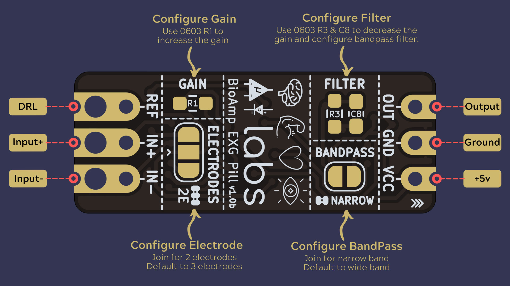

Introduction
============

BioAmp EXG Pill is a small (2.54 X 1.00 cm) and elegant Analog Front End (AFE) board for BioPotential signal acquisition that you can use with any 5v Micro Controller Unit (MCU) with an ADC. It is capable of recording publication grade BioPotential signals like ECG, EMG, EOG, and EEG without the inclusion of any dedicated Hardware/Software filter, see `BioAmp EXG Pill v0.7 intro video <https://www.youtube.com/watch?v=-G3z9fvQnuw>`_ for more info. The v1.0 of BioAmp EXG pill provides even more flexibilty with configuration option for Gain, BandPass, Filter, and Electrodes.
   

.. figure:: images/EXG-misc/BioAmp-EXG-Pill-Assembled.jpg
   :align: center
   :alt: BioAmp-EXG-Pill-Assembled

   BioAmp-EXG-Pill-Assembled

|                                                                   

.. Figure:: images/Board/bioamp-exg-pill-board-connection.jpg 
   :width: 550px                 
   :align: center 
   :alt: Connection

   BioAmp-EXG-Pill-Connections                                                                                                                 

   BioAmp-EXG-Pill-Configuration

|

.. Figure:: images/EXG-circuit/Basic-Circuit.jpg
   :width: 600px
   :align: center
   :alt: BioAmp-EXG-Pill Basic-circuit
   
   BioAmp-EXG-Pill Basic-circuit

.. Figure:: images/EMG/bioamp-exg-pill-electromyograph.jpg 
   :width: 600px
   :align: center
   :alt: bioamp-exg-pill-electromyograph.jpg

   BioAmp-EXG-Pill Electomyograph

.. Figure:: images/EOG/bioamp-exg-pill-electrooculography-horizontal.jpg 
   :width: 600px
   :align: center
   :alt: bioamp-exg-pill-electrooculography-horizontal.jpg

   BioAmp-EXG-Pill Electrooculography-horizontal

.. Figure:: images/EOG/bioamp-exg-pill-electrooculography-vertical.jpg 
   :width: 600px
   :align: center
   :alt: bioamp-exg-pill-electrooculography-vertical.jpg

   BioAmp-EXG-Pill Electrooculography-vertical

.. Figure:: images/ECG/bioamp-exg-pill-electrocardiography-Lead1.jpg 
   :width: 600px
   :align: center
   :alt: Electrocardiography (ECG) Lead-1

   BioAmp-EXG-Pill Electrocardiography (ECG) Lead-1

.. Figure:: images/EEG/bioamp-exg-pill-electroencephalography.jpg 
   :width: 600px
   :align: center
   :alt: Electroencephalography (EEG)

   BioAmp-EXG-Pill Electroencephalography (EEG)

Software
********

BioAmp EXG Pill works with any 5V microcontroller with an ADC like Arduino UNO/Nano or you can use dedicated 5v compatible ADC like ADS1115. To help with signal processing and cleaning you can use the included Arduino example sketches listed below.

.. list-table::
   :class: longtable
   :widths: 7 25 60
   :header-rows: 1
   
   * - SNO.
     - Program
     - Description
   * - 1.
     - `FixedSampling <#>`_
     - Sample from ADC at a fixed rate for easy processing of signal.
   * - 2.
     - `EMGFilter <#>`_
     - A 74.5 - 149.5 Hz band pass filter sketch for clean Electromyography.
   * - 3. 
     - `ECGFilter <#>`_
     -  A 0.5 - 44.5 Hz band-pass filter sketch for clean Electrocardiography.
   * -  4. 
     - `EOGFilter <#>`_
     - A 0.5 - 19.5 Hz band-pass filter sketch for clean Electrooculography.
   * - 5. 
     - `EEGFilter <#>`_
     - A 0.5 - 29.5 Hz band-pass filter sketch for clean Electroencephalography.
   * - 6. 
     - `EMGEnvelop <#>`_
     - EMG signal envelop detection for robotics and biomedical applications.
   * - 7. 
     - `LEDBarGraph <#>`_
     - LED bar graph showing EMG amplitude.
   * - 8. 
     - `ServoControl <#>`_
     - Servo motor control with EMG.
   * - 9. 
     - `HeartBeatDetection <#>`_
     - Standard deviation based heart beat detection algorithm.
   * - 10. 
     - `EyeBlinkDetection <#>`_
     - EOG based eye blink detection.
   * - 11. 
     - `DrowsinessDetection <#>`_
     - Drowsiness detection using eye blink detection.
   * - 12. 
     - `ClawController <#>`_
     - Servo claw controller 
   * - 13. 
     - `EOGPhotoCaptureBLE <#>`_
     - EOG based photo clicking machine using ESP32 BLE 

**To-Do:**

.. list-table::
   :class: longtable 
   :widths: 7 25 60
   :header-rows: 1

   * - No. 
     - Program
     - Description 
   * - 1. 
     - BrainWaves 
     - Brain waves amplitude with FFT.
   * - 2. 
     - EOGController 
     - EOG based eye movement detection (left/right) to create a game controller.

Hardware
********

BioAmp EXG Pill has been created using KiCad and all the design files can be found under `hardware <#>`_ folder, including production `Gerber <#>`_ files. Images below shows a quick overview of the hardware design.

|

.. Figure:: images/Bioamp-beta/BioAmp-EXG-Pill-v1.0b-front-black.png 
   :width: 550px
   :align: center
   :alt: Bioamp-EXG-Pill Front

   Bioamp-EXG-Pill Front 

.. Figure:: images/Bioamp-beta/BioAmp-EXG-Pill-v1.0b-back-black.png
   :width: 550px 
   :align: center
   :alt: Bioamp-EXG-Pill Back

   Bioamp-EXG-Pill Back 

.. Figure:: images/Bioamp-beta/BioAmp-EXG-Pill-v1-beta-black-render.png
   :width: 550px 
   :align: center
   :alt: Bioamp EXG Pill v1-Beta-Black

   Bioamp EXG Pill v1-Beta-Black

BioAmp-EXG-Pill Dimensions & Schematic
---------------------------------------

+----------------------------------------------------------------------+---------------------------------------------------------------------------+
| .. Figure:: images/Bioamp-beta/BioAmp-EXG-Pill-v1.0b-dimensions.png  |  .. Figure:: images/Bioamp-beta/BioAmp-EXG-Pill-v1.0b-schematic.png       |
|    :width: 150px                                                     |     :width: 450px                                                         |
|    :alt: Dimensions diagram                                          |     :alt: Schematic                                                       |                                                                 
|                                                                      |                                                                           |             
|    Bioamp-exg-pill Dimensions                                        |     Schematic                                                             |            
+----------------------------------------------------------------------+---------------------------------------------------------------------------+

